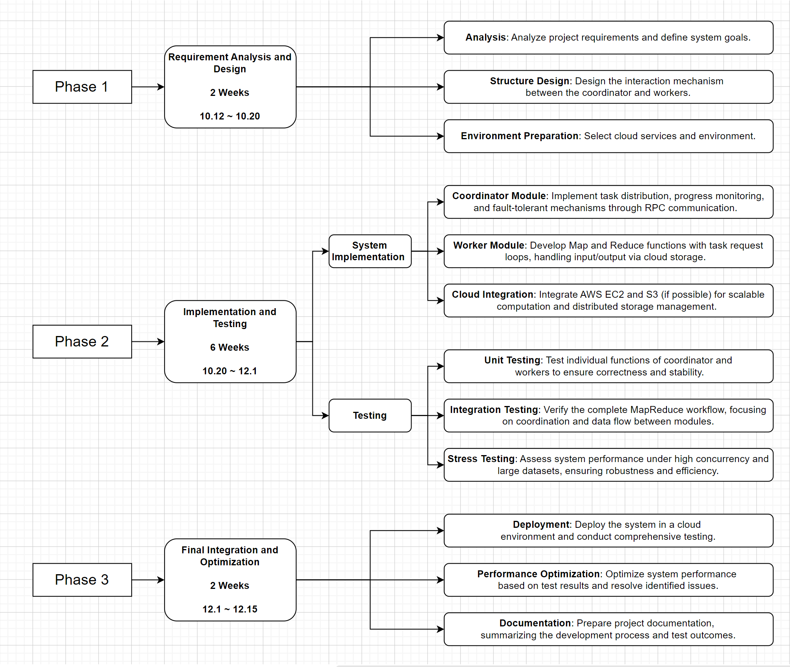

环境：
EC2: m5.large, Ubuntu 24.04 LTS
S3: same region as EC2
gcc: version (Ubuntu 13.3.0-6ubuntu2~24.04) 13.3.0
go: version go1.21.1 linux/amd64

1. 云环境集成（完成）
EC2新建实例，写好的代码上传到EC2

S3新建桶，上传需要进行MapReduce的数据
（没有权限访问，因为IAM没法新建Users）
写了个python脚本 ./py/download.py 从开放的s3桶里抓取下载需要跑的文件保存在./src/main

go构建：go build -buildmode=plugin wc.go
删除之前的输出：rm mr-out*
coordinator 运行需要MapReduce的：go run mrcoordinator.go pg-*.txt
另开一个命令行，作为worker，运行go run mrworker.go ../mrapps/wc.so
检查输出结果：ls mr-out- *

2. 自动扩展与容错

  (2) 集成 AWS Auto Recovery
    配置 EC2 实例的自动恢复机制，以应对硬件故障或实例宕机

3. 性能测试

  CloudWatch 监控记录一下吧 我打算配一个cloudwatch环境，run的时候截点图可视化一下

