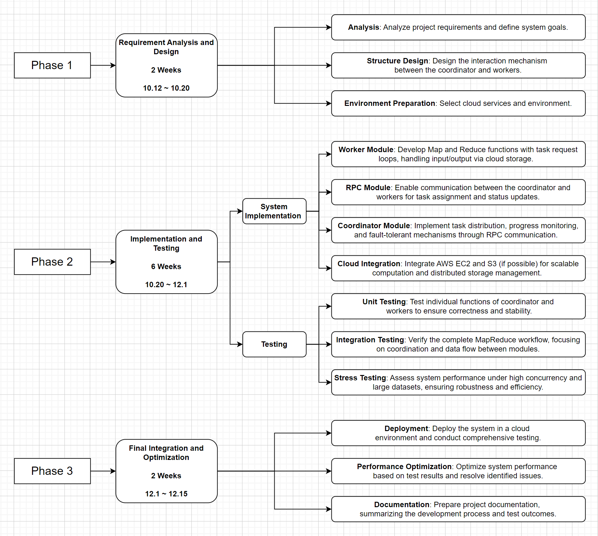

# **项目中期报告**  
## **Report**  

### Name: Xu Boshi & Chen Danyang
### Student ID: 122040075 & 123090018 

---

# **1. Introduction**

## **1.1 Background and Motivation**  
The rapid growth of data in various domains has led to an increasing demand for efficient processing and analysis methods. Traditional single-node systems struggle to handle the scale and complexity of modern datasets. To address this, distributed computing models like MapReduce have emerged as powerful solutions. Originally introduced by Google, MapReduce simplifies large-scale data processing by dividing tasks into smaller, manageable subtasks that can be executed in parallel across multiple nodes. This approach has proven effective in industries ranging from e-commerce to scientific research[1].

In recent years, cloud computing has further revolutionized distributed systems. By leveraging cloud platforms such as AWS, organizations can dynamically allocate resources, ensuring scalability, fault tolerance, and cost efficiency. These advancements make it feasible to deploy robust distributed systems that can process massive datasets while maintaining high availability and resilience. This project integrates these cutting-edge technologies to develop a cloud-enabled distributed MapReduce system, combining the strengths of the MapReduce model with the flexibility and scalability of cloud infrastructure.

## **1.2 Objectives**  
The primary goal of this project is to implement a functional, cloud-based distributed MapReduce system. This system aims to achieve the following objectives:  

- **Develop a Coordinator and Worker Framework**:  
  Implement a master-worker architecture where the coordinator assigns tasks and monitors worker progress, ensuring fault tolerance through task reassignment.  

- **Leverage Cloud Resources**:  
  Utilize AWS services like EC2 for computation, S3 for data storage, and Auto Scaling for dynamic resource allocation based on workload demands.  

- **Ensure Fault Tolerance and High Availability**:  
  Design the system to handle worker failures gracefully, ensuring continuous operation without manual intervention.  

- **Optimize for Scalability and Performance**:  
  Demonstrate the system's ability to efficiently process large datasets by scaling horizontally across multiple nodes.  

- **Enhance Security (Optional)**:  
  Implement data security measures, including encryption and controlled access using AWS IAM roles and policies.  

By achieving these goals, the project will showcase how modern cloud computing technologies can enhance traditional distributed systems, offering a scalable, resilient, and efficient solution for large-scale data processing.

---

### **2. Project Roadmap**    

#### **2.1 Requirement Analysis and Design [Week 1-2]**  
- **Requirement Definition**: Analyze project requirements and establish functional and performance objectives.  
- **System Design**: Design the system architecture, focusing on the interaction between the coordinator and workers.  
- **Technology Selection**: Choose suitable cloud services, such as AWS EC2 and S3, for system deployment.  

#### **2.2 Implementation and Testing [Week 3-7]**  
- **System Implementation**:  
  - **Coordinator Implementation**: Develop the coordinator module for task assignment, progress tracking, and fault-tolerance mechanisms.  
  - **Worker Implementation**: Implement the worker module to perform Map and Reduce operations, handling data processing tasks.  
  - **Cloud Integration**: Integrate AWS EC2 for computation and S3 for distributed storage to enable a scalable system.  

- **Testing**:  
  - **Unit Testing**: Test individual functions of the coordinator and worker modules to ensure accuracy and reliability.  
  - **Integration Testing**: Validate the complete MapReduce workflow, focusing on seamless communication and data processing.  
  - **Stress Testing**: Assess system performance under high concurrency and large datasets to ensure robustness and efficiency.  

#### **2.3 Final Integration and Optimization [Week 8-10]**  
- **Deployment**: Deploy the system in a cloud environment and conduct comprehensive testing.  
- **Performance Optimization**: Optimize system performance based on test results and resolve identified issues.  
- **Documentation**: Prepare project documentation, summarizing the development process and test outcomes.  

---
# 需要更改内容！！！！！！！！！！！！！！！是瞎写的！！

### **3. Preliminary Results**

#### **3.1 Implemented Features or Modules**  
- **Coordinator Module**: The coordinator module has been successfully implemented, including task distribution, progress tracking, and fault-tolerance mechanisms. It ensures task reassignment in case of worker failure.  
- **Worker Module**: The worker module is functional, capable of executing Map and Reduce tasks. It reads input data from S3, processes it, and writes output back to S3.  
- **Basic Cloud Integration**: The system has been deployed on AWS EC2 instances, with coordinator and worker nodes running in a distributed environment.  

#### **3.2 Preliminary Experimental Results**  
- **Data Visualization**:  
  Initial tests involved processing a sample dataset. The following graph illustrates the task completion times for different data sizes:  

  - Task completion time decreases as more workers are added.  
  - Visualization shows a clear improvement in performance when scaling up worker instances.  

- **Result Analysis**:  
  - **Efficiency**: The system demonstrated efficient parallel processing, with task distribution and completion occurring as expected.  
  - **Scalability**: Preliminary tests confirmed the system's ability to scale horizontally by adding more EC2 instances.  
  - **Fault Tolerance**: The system successfully reassigned tasks to healthy workers when simulated failures were introduced, ensuring task completion without manual intervention.  

These results provide a strong foundation for further testing and optimization. 

---

### **4. Next Steps**  

#### **4.1 Planned Tasks**  
- **Code Completion and Testing**: We plan to finalize the implementation and testing of the MapReduce framework within the next few weeks.  
- **Cloud Deployment**: Ensure the system operates seamlessly on AWS EC2 instances, leveraging cloud resources for distributed processing.  
- **Performance Validation**: Conduct thorough testing on the cloud to validate system scalability, fault tolerance, and overall performance under real-world conditions.

#### **4.2 Improvement and Optimization Directions**  

- **Data Transfer Optimization**: Reduce data transfer overhead between nodes by trying to implement more efficient intermediate data storage and retrieval mechanisms.  
- **Security Improvements**: Enhance data security by incorporating encryption for both data at rest in S3 and data in transit between EC2 instances.  
- **Monitoring and Logging**: Integrate AWS CloudWatch for real-time monitoring and detailed logging, enabling better system analysis and troubleshooting.
  

---

### **5. Conclusion**  

# 5.1需要更改内容！！！！！！！！！！！！！！！是瞎写的！！
#### **5.1 Summary of Current Progress**  
- The project has successfully completed the deployment of the development environment on AWS, along with the initial implementation of key components, including the coordinator and worker modules.  
- Basic functionality such as task distribution, fault tolerance, and MapReduce operations has been tested and validated.  
- The system is currently running in a cloud environment, demonstrating the ability to perform distributed data processing across multiple EC2 instances.  

#### **5.2 Future Outlook**  
- **Enhanced Performance and Scalability**: With further optimization, the system is expected to handle larger datasets efficiently, showcasing the true potential of cloud-enabled distributed systems.  
- **Robust Fault Tolerance**: Improved failure recovery mechanisms will ensure uninterrupted operation in real-world scenarios.  
- **Practical Applications**: This project could serve as a foundational model for large-scale data processing in industries such as e-commerce, scientific research, and financial analysis.  
- **Learning Outcomes**: The team will gain valuable insights into cloud computing, distributed systems, and data processing, contributing to both academic growth and practical skills development.   

---

### **6. Reference**  
1. Dean, J., & Ghemawat, S. (2004). MapReduce: Simplified Data Processing on Large Clusters. *OSDI '04: 6th Symposium on Operating Systems Design and Implementation*, USENIX Association.
2. *MIT Graduate Course 6.5840: Distributed Systems (Spring 2024) - Lab: MapReduce*. Retrieved from [https://pdos.csail.mit.edu/6.824/labs/lab-mr.html](https://pdos.csail.mit.edu/6.824/labs/lab-mr.html).
